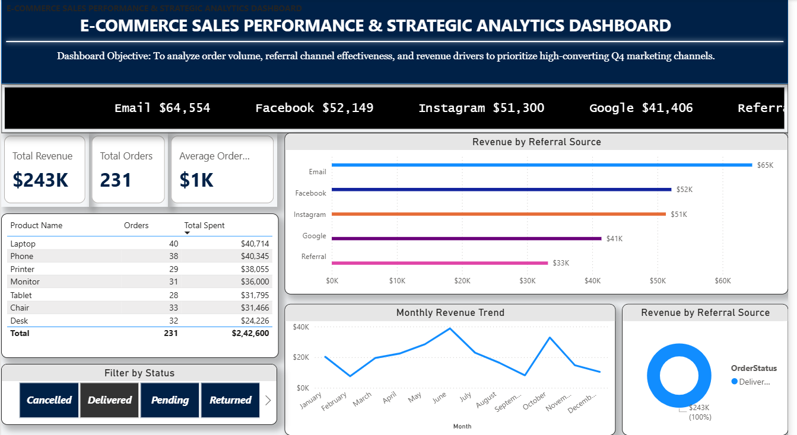

# 📊 E-Commerce Sales Performance & Strategic Analytics Dashboard

An interactive executive dashboard built in Power BI to analyze order volumes, referral channel effectiveness, revenue drivers, and order statuses to optimize high-converting Q4 marketing channels.

---

## 🖼️ Dashboard Overview



---

## Key Features & Insights

* **Executive KPI Cards:** Quick view of Total Revenue, Total Orders, and Average Order Value (AOV).
* **Live Revenue Ticker:** Real-time channel revenue ticker banner across the top header.
* **Top Performing Products:** Ranked view of order volume and total revenue generated per product line.
* **Referral Channel Breakdown:** Multi-color bar visual comparing channel revenue across Instagram, Email, Google, Facebook, and Organic Referrals.
* **Monthly Sales Trend:** Time-series area chart tracking revenue fluctuations throughout the year.
* **Order Status Breakdown:** Donut visual analyzing distribution across Delivered, Pending, Returned, and Cancelled orders.
* **Interactive Button Slicers:** Dynamic filtering by Order Status with immediate cross-filtering across all visuals.

---

## 🛠️ Tools & Technologies Used

* **Business Intelligence Tool:** Power BI Desktop
* **Data Modeling & Calculations:** DAX (Data Analysis Expressions)
* **Design & UX:** Custom theme styling, container card drop shadows, dark mode navigation headers

---

## 📁 Repository Structure

```text
├── Ecommerce_Sales_Analytics_Dashboard.pbix  # Power BI Project File
├── Data-Analytics-Project-2_Decode_labs.csv  # Raw Dataset
├── dashboard_preview.png                     # Dashboard Screenshot
└── README.md                                 # Project Documentation
